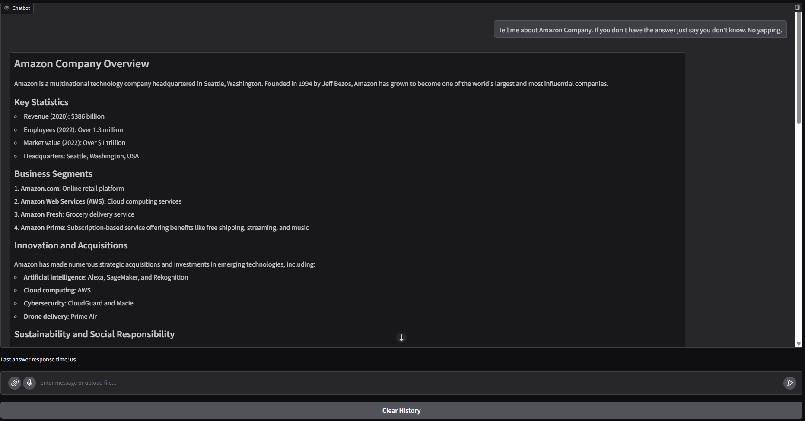

# Llm_inference
 (**optional**)
You should create an .env file to set the port and server IP:
 ```
    GRADIO_SERVER_PORT=8080
    GRADIO_SERVER_NAME=0.0.0.0
 ```
## Build Docker
To build the Docker container from the Dockerfile, run the following command:
`docker build -t gradio-app .`

## Run Docker Container
To run the Docker container you just built, use this command:
`docker run --gpus all -p 8080:8080 -it gradio-app`
**Note**:
- After running the Docker container, you can access the chatbot at: http://localhost:8080/

- If you don't want to use port 8080 or localhost, you can change the environment variables declared in the Dockerfile.

- To save and load chat history, you can add -v <local_path>:/src to mount the src/history.json file to your local machine.

The chat interface will look like this when running:
